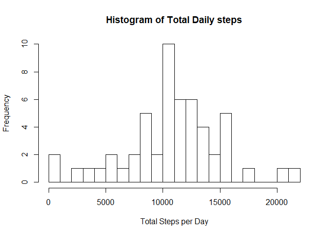
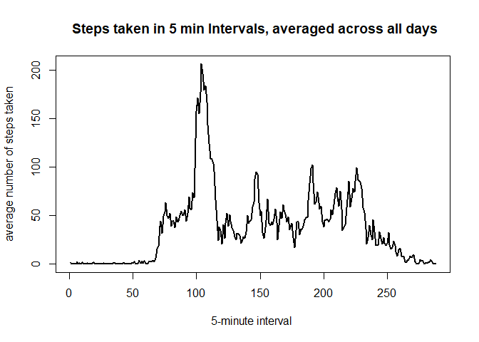
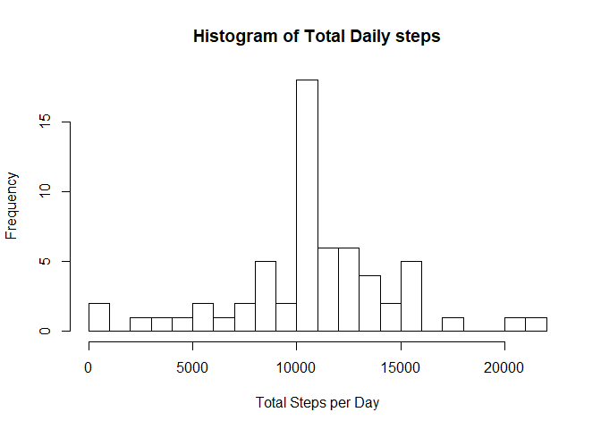
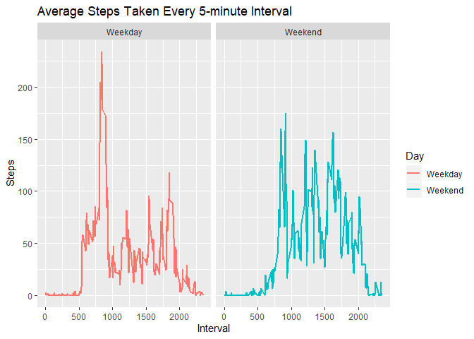

## 1. Loading and preprocessing the data

Using the code below I load and preprocess the data into a format suitable for my analysis. If the data is not already present in the current directory, the data is downloaded from the course web site and unzipped.


```r
if(!file.exists("activity.csv")){
  
  file.url <- ("https://d396qusza40orc.cloudfront.net/repdata%2Fdata%2Factivity.zip")
  download.file(file.url,"repdata_data_activity.zip")
  unzip("repdata_data_activity.zip")
}
if(!exists("activity1")){
  activity1 <- read.csv("activity.csv")}
```

## 2. Process/transform the data (if necessary) into a format suitable for your analysis 

I use code below to ignore the missing values in the dataset. Additional transformation of raw data are done during computations as needed. 

```r
activity <-na.omit(activity1)
```

## What is mean total number of steps taken per day?  
### 1. Calculate the total number of steps taken per day 


```r
total_steps_perday<-tapply(activity$steps, activity$date, FUN=sum,na.rm = T)
```

### 2. Make a histogram of the total number of steps taken each day.  


```r
hist(total_steps_perday,xlab="Total Steps per Day", main = "Histogram of Total Daily steps",breaks = 30)
```

<!-- -->

### 3. calculate and report the mean and median of the total number of steps taken per day 


```r
result.mean <- mean(total_steps_perday,na.rm = T)
result.median <- median(total_steps_perday,na.rm = T)
print(c("Mean of steps taken per day",as.numeric(result.mean)))
```

```
## [1] "Mean of steps taken per day" "10766.1886792453"
```

```r
print(c("Median of steps taken per day",as.numeric(result.median)))
```

```
## [1] "Median of steps taken per day" "10765"
```


## What is the average daily activity pattern?  
### 1. Make a time series plot (i.e. \color{red}{\verb|type = "l"|}type="l") of the 5-minute interval (x-axis) and the average number of steps taken, averaged across all days (y-axis)
First I make a time series plot of the 5-minute interval (x-axis) and the average number of steps taken, averaged across all days (y-axis)


```r
mean_steps_perinterval<-tapply(activity$steps, activity$interval, FUN=mean,na.rm = T)
plot(mean_steps_perinterval,type="l", lwd=2, xlab="5-minute interval ", ylab="average number of steps taken", main=" Steps taken in 5 min Intervals, averaged across all days")
```

<!-- -->

### 2. Which 5-minute interval,on average across all the days in the dataset, contains the maximum number of steps?  

The 5-minute interval, on average across all the days in the dataset, that contains the maximum number of steps is computed from the peak of the time series plot. The peak of the plot is the maximum number of steps on average across all day. The average daily activity pattern are respresented as an aray and the names of elements correspond to the corresponding five minute interval. the The corresponding five minute interval is determined from the name of the maximum number of steps.

```r
max_int<-activity$interval[which(mean_steps_perinterval==max(mean_steps_perinterval))]
print(c("Time Interval",max_int,"contains the maximum number of steps across on average across all the days in the dataset"))
```

```
## [1] "Time Interval"                                                                            
## [2] "835"                                                                                      
## [3] "contains the maximum number of steps across on average across all the days in the dataset"
```

## Imputing missing values 

### 1. Calculate and report the total number of missing values in the dataset (i.e. the total number of rows with \color{red}{\verb|NA|}NAs)

The presence of missing days may introduce bias into some calculations or summaries of the data.  (i.e. the total number of rows with \color{red}{\verb|NA|}NAs)

```r
mv<-is.na(activity1)
print(c("The total number of missing values in the dataset is",sum(mv)))
```

```
## [1] "The total number of missing values in the dataset is"
## [2] "2304"
```

### 2. Devise a strategy for filling in all of the missing values in the dataset. The strategy does not need to be sophisticated. For example, you could use the mean/median for that day, or the mean for that 5-minute interval, etc.
### 3. Create a new dataset that is equal to the original dataset but with the missing data filled in.

To fill in all of the missing values in the dataset, I use the mean for that 5-minute interval. I create a new dataset called activity11 that is equal to the original dataset but with the missing data filled in by the mean of the 5 minute interval.

```r
na_steps<-is.na(activity1)
activity11<-activity1

activity11$steps[na_steps[,1]]<- mean_steps_perinterval[as.character(activity1$interval[na_steps[,1]])]
print(c("Total numer of missing values after missing values are replacec by mean for that 5-minute interval is",sum(is.na(activity11$steps))))
```

```
## [1] "Total numer of missing values after missing values are replacec by mean for that 5-minute interval is"
## [2] "0"
```

### 4. Make a histogram of the total number of steps taken each day and Calculate and report the mean and median total number of steps taken per day. Do these values differ from the estimates from the first part of the assignment? What is the impact of imputing missing data on the estimates of the total daily number of steps? 


Below I make a histogram of the total number of steps taken each day, calculate and report the mean and median total number of steps taken per day. The mean and median from the first part of the assignment are reported for comparision.


```r
total_steps_perday2<-tapply(activity11$steps, activity11$date, FUN=sum,na.rm = T)

hist(total_steps_perday2,xlab="Total Steps per Day", main = "Histogram of Total Daily steps",breaks = 30)
```

<!-- -->

```r
result2.mean <- mean(total_steps_perday2,na.rm = T)
print(c("New Mean",result2.mean,"Old Mean",result.mean))
```

```
## [1] "New Mean"         "10766.1886792453" "Old Mean"         "10766.1886792453"
```

```r
result2.median <- median(total_steps_perday2,na.rm = T)
print(c("New Meadian",result2.median,"Old Meadian",result.median))
```

```
## [1] "New Meadian"      "10766.1886792453" "Old Meadian"      "10765"
```


Imputing missing data did not change the mean. Imputing the missing data however changed the median of total daily number of steps. Imputing the missing data increased the median and the median became identical to the mean. The impact of imputing the missing data was to center the distribution of the total number of steps per day. The median of the total number of steps per day is less than the mean when the missing data are not imputed.This indicates the presence of missing data has skewing effect on the distribution of total number of steps per day. the effect of the missing data is to the right since the median is less than the mean. The effect of skewness to the right can also be observed visually from the histograms.

# Are there differences in activity patterns between weekdays and weekends?  
### 1. Create a new factor variable in the dataset with two levels – “weekday” and “weekend” indicating whether a given date is a weekday or weekend day. 

Using the dataset with the filled-in missing values,I create a new factor variable in the dataset with two levels – “weekday” and “weekend” indicating whether a given date is a weekday or weekend day.

```r
activity$date<-as.Date(activity$date)
weekday<-weekdays(activity$date)
activity$weekend<-factor(weekday,levels = c("Monday","Tuesday","Wednesday","Thursday","Friday","Saturday","Sunday"),labels=c("Weekday","Weekday","Weekday","Weekday","Weekday","Weekend","Weekend"))
```


Below is a plot containing a time series plot of the 5-minute interval (x-axis) and the average number of steps taken, averaged across all weekday days or weekend days (y-axis). The plot shows differences in peak activity patterns between weekdays and weekends. The average steps during the week has a peak around 800th 5 minute interval while the steps during the week appear randomly spread between the 800th and 2000th 5 minute interval. 

### 2. Make a panel plot containing a time series plot (i.e. \color{red}{\verb|type = "l"|}type="l") of the 5-minute interval (x-axis) and the average number of steps taken, averaged across all weekday days or weekend days (y-axis). 


```r
a<-aggregate(activity$steps,by=list(activity$interval,activity$weekend),mean)

names(a)[3]<-"Steps"
names(a)[2]<-"Day"
g<-ggplot(a,aes(x = Group.1,y = Steps,color =Day))+geom_line(size = 1)+facet_wrap(~Day, strip.position = "top")+
  xlab("Interval")+ggtitle("Average Steps Taken Every 5-minute Interval")
plot(g)
```

<!-- -->

